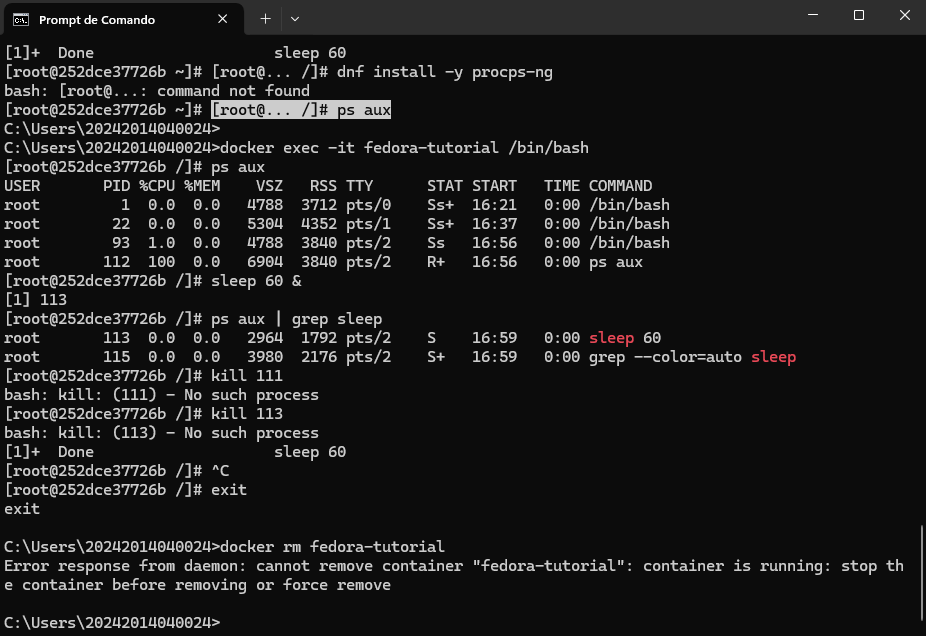

# Relatório da Atividade Prática: Introdução a Docker/Linux

- **Aluno:** Rodrigo Soares
- **Data:** 17/09/2025

---

## 1. Introdução

O objetivo desta atividade foi praticar comandos fundamentais do sistema operacional Linux dentro de um ambiente seguro e isolado, fornecido por um contêiner Docker com a imagem do Fedora. Foram abordados conceitos de navegação no sistema de arquivos, manipulação de arquivos e diretórios, gerenciamento de pacotes, controle de permissões e monitoramento de processos.

---

## 2. Relato das Atividades

A seguir, são descritos os passos executados e os resultados obtidos, com as respectivas capturas de tela.

### 2.1. Início do Contêiner Fedora
O contêiner foi iniciado com o comando `docker run -it --name fedora-tutorial fedora:latest /bin/bash`. A imagem foi baixada e o terminal interativo foi acessado com sucesso.

### 2.2. Navegação Básica
Foram utilizados os comandos `pwd`, `cd`, `ls` e `mkdir` para navegar entre os diretórios, listar seu conteúdo e criar uma nova pasta chamada "atividades".

### 2.3. Manipulação de Arquivos
Nesta etapa, foram executadas tarefas de criação (`touch`), renomeação (`mv`), cópia (`cp`) e exclusão (`rm`) de arquivos, praticando o uso de caminhos relativos e absolutos (`~/`).

### 2.4. Gerenciamento de Pacotes com DNF
O gerenciador de pacotes `dnf` foi utilizado para atualizar o sistema e para instalar e remover o editor de texto `nano`.

**Instalação do Nano:**

**Remoção do Nano:**

### 2.5. Permissões de Arquivos
O comando `chmod u+x` foi usado para conceder permissão de execução ao dono do arquivo `script.sh`. A verificação foi feita com `ls -l` antes e depois da alteração.

### 2.6. Gerenciamento de Processos
Foi iniciado um processo `sleep` em segundo plano. O seu PID foi identificado com `ps aux | grep sleep` e, em seguida, o processo foi encerrado com o comando `kill`.

### 2.7. Encerramento e Limpeza
Finalmente, saí do contêiner com `exit` e o removi do sistema com `docker rm fedora-tutorial`.

---

## 3. Conclusão

* **O que você aprendeu?** Com esta atividade, aprendi na prática como funcionam os comandos essenciais do Linux... Entendi melhor o conceito de diretório home e a importância de gerenciar permissões.
* **Quais foram suas dificuldades?** Minha principal dificuldade foi entender a sintaxe do comando `docker run` no início, mas a descrição ajudou..." ou "Não tive grandes dificuldades, os passos foram claros.
* **Qual a importância do Docker nesse contexto?**Percebi que o Docker é uma ferramenta poderosa para criar ambientes de teste sem precisar instalar uma máquina virtual completa, tornando o processo mais rápido e limpo.

